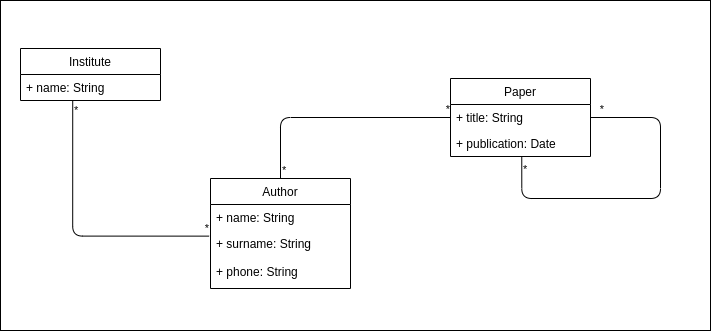

# Quotation App

## Use case
As an exercise the API of a quotation app has to be created in order to be able to maintain authors, institutes and papers. Authors can work for different institutes and can write papers. Papers can quote other papers. 

The data model is shown in the following figure:



## Technical Solution

### Classical approach
A classical approach is to setup a JEE project (with standard components as JPA, JAX-RS, ...) and a postgreSQL database. 

### NoSQL approach
An alternative approach might be setting up an GRANDstack (https://grandstack.io/) application (API-only), consisting of a GraphQL API and a neo4j database.

### Which solution should be choosen?
This depends mainly on the expected queries. If the queries are more related to the entities and the properties of that entities the classical approach might be well suited. It is a stable and well defined platform. 
If the queries are expected to be more focused on the relations and analytics on the relations (i.e. how distant are two authors in terms of papers, what is the mean of that distance accross the whole graph), than a graph database outperformes a relational database.

For this exercise I went for the NoSQL approach: both approaches works well for this exercise, but I have done a couple of JEE projects and I am curious to do some hands on with a GraphQL API :-)

## How this app was developed
- wrote a script to run a neo4j database in a local docker environment
- created a GRANDstack starter application (see https://grandstack.io/docs/getting-started-neo4j-graphql) and selected API-only during initialization
- done a bit cleanup and removed unused parts of the code
- designed the data model within the schema.graphql for the GraphQL API
- created a dummy data script 

## How to run the API locally
- start neo4j
```
./neo4j/run_neo4j.sh
```
In case you are running the script multiple times remove the container first
```
docker rm quotation-db
```
- import dummy data: copy content from script ```./neo4j/data.cypher``` in the neo4j browser and run the query
- change to folder ```graphql-api```
- create ```.env``` file in folder ```graphql-api/api``` with content:
```
NEO4J_URI=bolt://localhost:7687
NEO4J_USER=neo4j
NEO4J_PASSWORD=s3cr3t

# Uncomment this line to specify a specific Neo4j database (v4.x+ only)
#NEO4J_DATABASE=neo4j

GRAPHQL_SERVER_HOST=0.0.0.0
GRAPHQL_SERVER_PORT=4001
GRAPHQL_SERVER_PATH=/graphql
```
- execute ```npm install``` (and ignore warnings)
- execute ```npm run start```

## How to test the API locally
The browser to test the GraphQL API can be accessed here: http://0.0.0.0:4001/graphql

### Sample query
```
{
  institutes {
    name, 
    authors {
      name, 
      surName, 
      papers {
        title, 
        publication
      }
    }
  }
}
```

# Troubleshoot

## npm ERR! code ELIFECYCLE
Follow the instructions https://stackoverflow.com/questions/42308879/how-to-solve-npm-error-npm-err-code-elifecycle for the folders ```graphql-api``` and ```graphql-api/api```